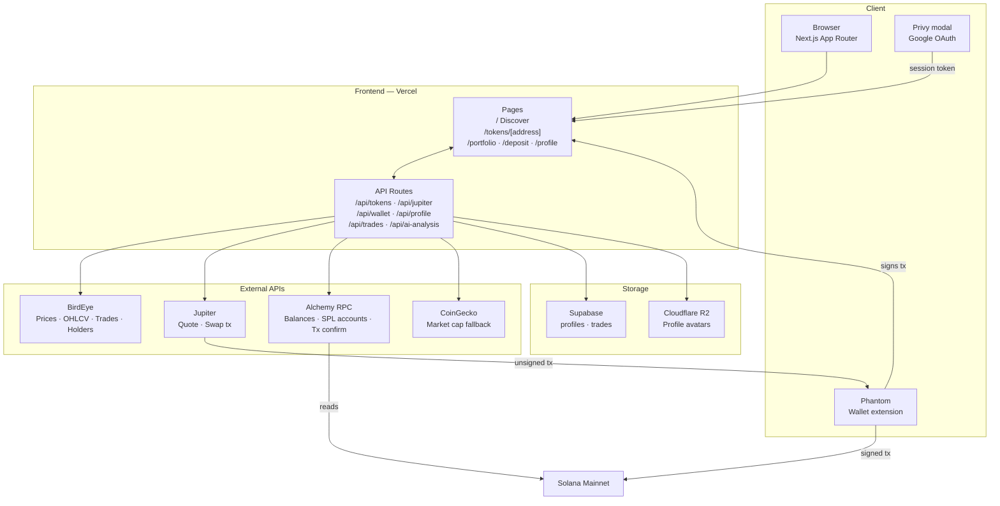
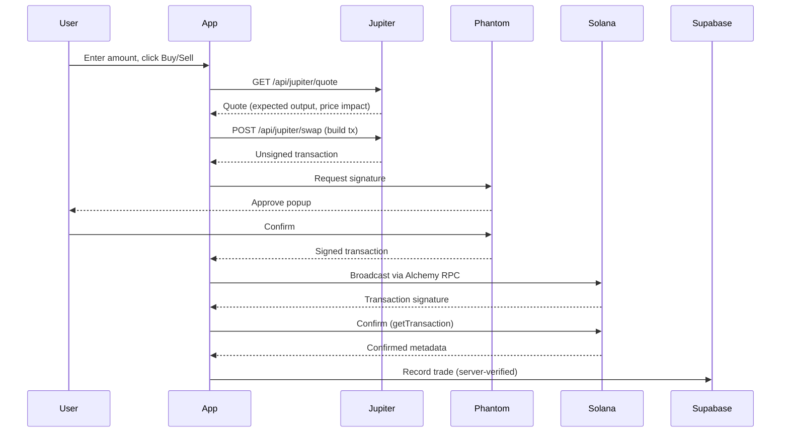

# ChadWallet

ChadWallet is a Solana memecoin trading app built with Next.js, Privy, BirdEye, Alchemy RPC, Supabase, Cloudflare R2, and Vercel.

## Architecture



## Swap flow



## Production Scope

- Privy handles Google and Solana wallet authentication.
- BirdEye powers token discovery, token pages, holders, live trades, OHLCV, and wallet net worth.
- Alchemy RPC reads wallet balances, SPL token accounts, and confirmed swap transactions.
- Jupiter builds Solana swap transactions for user-side signing.
- Supabase stores profiles and immutable trade history behind server API routes.
- Cloudflare R2 stores profile avatars.

The app targets Solana mainnet data. Privy and BirdEye do not support the final product on devnet or testnet.

## Setup

1. Install dependencies.

```bash
npm ci
```

2. Create `.env.local`.

```bash
cp .env.local.example .env.local
```

3. Fill every required value in `.env.local`.

4. Apply the Supabase SQL.

Use `supabase/schema.sql` for a new project. For an existing project that already has ChadWallet tables, run `supabase/migrations/20260624_privy_auth_trade_hardening.sql`.

5. Run the app.

```bash
npm run dev
```

Open `http://localhost:3000`.

## Required Environment

Use `.env.local.example` as the source of truth for names.

- `NEXT_PUBLIC_PRIVY_APP_ID`
- `PRIVY_APP_SECRET`
- `NEXT_PUBLIC_SUPABASE_URL`
- `NEXT_PUBLIC_SUPABASE_ANON_KEY`
- `SUPABASE_SERVICE_ROLE_KEY`
- `BIRDEYE_API_KEY`
- `ALCHEMY_SOLANA_RPC_URL`
- `NEXT_PUBLIC_ALCHEMY_SOLANA_RPC_URL`
- `ANTHROPIC_API_KEY`
- `CLOUDFLARE_R2_ENDPOINT`
- `CLOUDFLARE_R2_ACCESS_KEY_ID`
- `CLOUDFLARE_R2_SECRET_ACCESS_KEY`
- `CLOUDFLARE_R2_PUBLIC_URL`

Server-only keys must stay server-only. Do not prefix service role, BirdEye, Anthropic, R2, or Privy app secret values with `NEXT_PUBLIC_`.

## Apple Sign-In

Apple sign-in is disabled in the app until Apple Developer enrollment and Privy Apple OAuth configuration are complete.

Confirm these values before debugging Apple login:

- Apple Team ID
- Services ID or App ID
- Key ID
- Sign in with Apple private key
- Privy redirect URI, usually `https://auth.privy.io/api/v1/oauth/callback`
- Production domain and local callback settings
- Exact Apple Developer or Privy error text

## Supabase

Run `supabase/schema.sql` in the Supabase SQL editor for a new project. If the project already has ChadWallet tables, run `supabase/migrations/20260624_privy_auth_trade_hardening.sql` instead. The app uses Privy auth, not Supabase Auth, so reads and writes go through server API routes with the service role key after Privy access-token verification.

Tables:

- `profiles`
- `trades`

`trades` stores confirmed on-chain swap records. The server verifies the Privy session, wallet ownership, transaction confirmation, wallet account key, traded token mint, token balance delta, and SOL balance delta before insert. Stored trade amounts are derived from confirmed transaction metadata.

## Verification

```bash
npx tsc --noEmit
npm run lint
npm run build
```

`npm run build` requires real environment values. Placeholder Privy IDs or missing server secrets can fail the build or runtime initialization.
